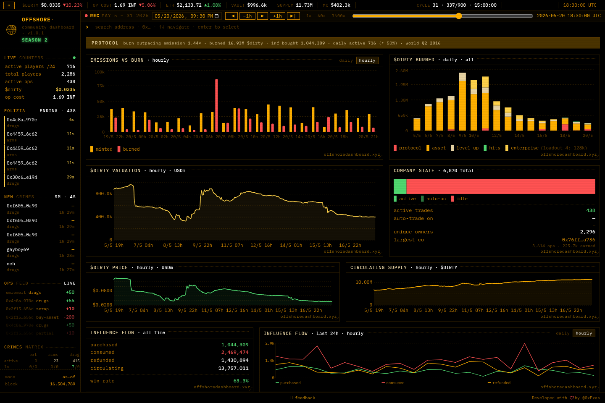
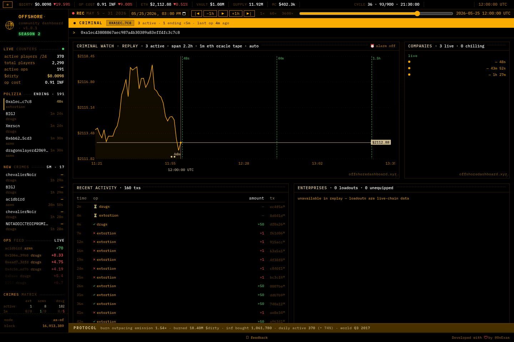

<div align="center">


# OFFSHORE · terminal

**a Bloomberg-style on-chain terminal for the Offshore Protocol on MegaETH —<br/>now replaying the protocol's complete recorded history, second by second.**

**[▶ open the live demo](https://offshoredashboard.xyz)** · [jump into the Season 2 launch](https://offshoredashboard.xyz/?at=2026-05-18T21:15:00Z) · built by [@0xExas](https://x.com/0xExas)



</div>

---

## the demo is a time machine

The Offshore Protocol — an on-chain crime game on MegaETH — paused on **May 31, 2026**. This terminal's indexer recorded its entire life: **May 5 → May 31, ~10.4M rows** of transfers, trades, hits, vault payouts, staking and prices.

So instead of a dead dashboard, the site replays the tape:

- **pick any second** of the recorded window with the date picker or the timeline scrubber
- **press play** — the whole terminal runs forward at **1×, 60× or 3600×** (the entire month replays in about ten minutes)
- **share any moment** — the URL always carries the clock: `?at=2026-05-26T01:55:00Z&speed=60` (use `speed=0` to hand someone a frozen frame)

Everything on screen is *as of the moment on the clock*: prices, rolling 24h windows, live feeds, trade countdowns, the block number — even the ETH price is what the oracle actually reported at that block.

## boards

emissions vs burn · $DIRTY valuation + market cap · influence flows · company state · vault cycles + cycle earners · live ops feed + crimes matrix · polizia (trades ending soon) · hits (Season 2 raids) · faction staking · activity heatmap · leaderboard · and a per-criminal **watch page** — ETH oracle chart with the wallet's running ops, indexed stats, and full activity history:

<div align="center">

</div>

## how the time machine works

**1 · one clock parameter.** `?at=` resolves to a unix second (`lib/demo-clock.js`) and every query in `lib/db/*` takes it as a trailing `asOf`: rolling windows become `[now − w, now]`, "latest" reads become `≤ now`. Live mode passes a far-future sentinel instead — replay and live share one code path, byte-identical when the demo flag is off.

**2 · reconstructing "active" from the past.** Company state is mutable on-chain, so *"what was running at 12:00:00 on May 20"* can't be read from any table directly. But every settled op's mint timestamp plus its fixed duration — 300s extortion / 1800s arms / 5400s drugs, verified from contract storage slots at index time — pins the trade's exact window. Active-at-T is a single indexed query (`lib/db/demo-trades.js`), and countdowns expire at precisely the tick the completion op scrolls into the feed.

**3 · the real ETH price, from the real oracle.** MegaETH runs 1s blocks with `timestamp = block + genesis`, and its RPC serves archive state. `scripts/backfill-eth-oracle.mjs` replayed `latestRoundData()` on the same RedStone adapter the terminal always used, at every minute of the window — **36,940 samples** of what the oracle actually said, not a CEX candle approximation.

**4 · the replay engine.** The client keeps a virtual clock (anchor + speed); seeking pauses so every deep link lands on a stable, screenshot-able frame, and the URL stays in sync. An 800ms pump asks the server *"what happened since my cursor, as of my virtual now"* — with drop-oldest sampling so 3600× reads like a fast tape instead of an ever-growing backlog.

**5 · immutable data, aggressive caching.** The tape can't change, so responses are cached per minute-bucketed `at` (small LRUs server-side, `immutable` cache headers for the CDN). Replay mode makes **zero** RPC or external calls at runtime.

## when the protocol was alive

The same codebase ran the live terminal, and switches back by unsetting one env flag:

```
MegaETH RPC ──▶ server/poller.js        WebSocket + 60s ticks
                  ├─ transfers           destination-first classification
                  │                      completed/busted from factory events (structural, not amount-based)
                  ├─ hits / staking / vault / influence
                  └─ snapshots           supply · $DIRTY price · INF cost
raw-log indexer ─▶ idx_logs              SQL views: v_dex_swaps · v_company_trades · v_vault_cycles
PostgreSQL      ─▶ app/api/*             Next.js 15 route handlers
```

Vault data is bucketed by the game's real cycle rules — Season 1 ran 3×8h weekday cycles and 24h weekends, Season 2 one 24h cycle anchored at 09:30 UTC, with the cutover on May 18 handled by a single season-aware helper (`getCycleStart`).

## stack

Next.js 15 (App Router) · [postgres.js](https://github.com/porsager/postgres) · a hand-rolled SVG chart library · an IBM Plex Mono terminal design system with four themes — no UI framework, no chart framework for the core boards.

## repo map

| path | what lives there |
|---|---|
| `app/` | the terminal — one page (`/` and `/criminal/[address]`), ~40 API route handlers |
| `app/_components/` | shell, boards, virtual clock, time bar, replay intro |
| `lib/demo-clock.js` | the `?at=` resolver + replay window constants |
| `lib/db/` | every query, all `asOf`-aware; `demo-trades.js` is the reconstruction |
| `server/` | the live-mode poller: syncs, classification, WS client |
| `scripts/` | one-shot backfills — incl. `backfill-eth-oracle.mjs` |
| `sql/schema.sql` | the PostgreSQL schema |
| `design/` | the terminal design system source |

## running it

```bash
npm install
npm run dev            # terminal on :3000
npm run build && npm start
npm run poller         # live-mode indexer (only useful while a protocol emits events)
```

`.env`:

| var | purpose |
|---|---|
| `DATABASE_URL` | PostgreSQL (required) |
| `DEMO_MODE=1` · `DEMO_DEFAULT_AT` | replay mode + the landing moment (unix or ISO) |
| `NEXT_PUBLIC_DEMO=1` · `NEXT_PUBLIC_DEMO_DEFAULT_AT` | client mirror (inlined at build) |
| `ALCHEMY_WS_URL` · `ETHERSCAN_KEY` | live-mode polling only |
| `API_KEY` | guards the admin routes |
| `TG_BOT_TOKEN` · `TG_CHAT_ID` | optional feedback → Telegram |

Honest note: replay needs the recorded dataset, which isn't in this repo (schema in `sql/schema.sql`). Without it you can run live mode against a chain — or just use the [hosted demo](https://offshoredashboard.xyz).

---

<div align="center">

*the protocol is paused — the tape lives on.*

built with ♥ by [@0xExas](https://x.com/0xExas)

</div>
